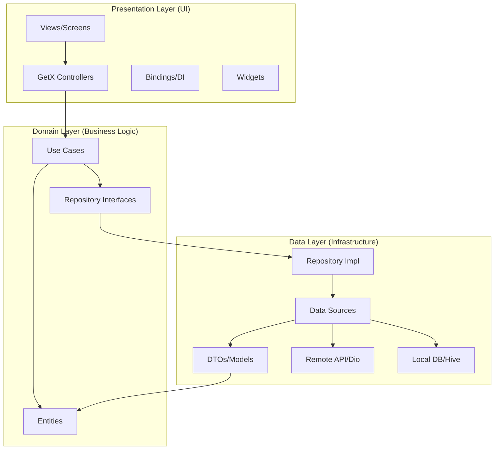
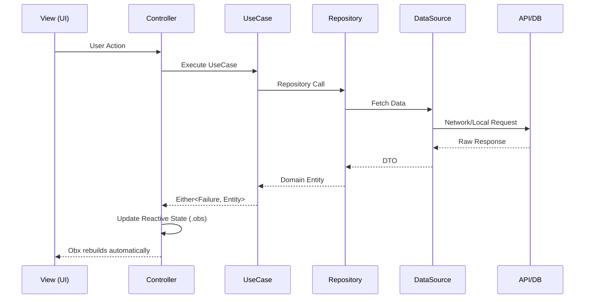
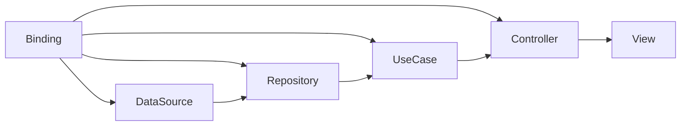

<div align="center">

# 🎬 StreamX

### Production-Ready Netflix-Style Video Streaming Application

[](https://flutter.dev)
[](https://dart.dev)
[](https://pub.dev/packages/get)
[](https://firebase.google.com)
[](LICENSE)
[](https://github.com/AvinashK123-A/streamx/actions)

**Enterprise-grade Flutter video streaming app built with Clean Architecture, GetX, and Firebase**

*Portfolio showcase demonstrating 6+ years Flutter expertise and Technical Lead capabilities*

[Features](#-features) • [Architecture](#-architecture) • [Setup](#-quick-start) • [Screenshots](#-screenshots) • [Tech Stack](#-tech-stack)

</div>

---

## 📋 Overview

StreamX is a production-ready, Netflix-inspired video streaming application built with Flutter. It demonstrates enterprise-level architecture patterns, clean code principles, and professional development practices suitable for large-scale deployment.

### Why StreamX?

This project showcases:
- **Technical Leadership** — Enterprise architecture decisions and patterns
- **Clean Architecture** — Strict separation of concerns with SOLID principles  
- **Production Readiness** — Error handling, analytics, crash reporting, offline support
- **Performance Engineering** — Lazy loading, memory optimization, smooth 60fps playback
- **DevOps Practices** — Complete CI/CD pipeline with GitHub Actions

---

## ✨ Features

### 🔐 Authentication
- Email/Password login & registration
- Remember Me with secure token storage
- Auto-login on app launch
- Forgot password flow
- Session management with refresh tokens

### 🏠 Home Screen
- Auto-scrolling featured banner (Netflix-style)
- Trending Now section with horizontal scroll
- Recommended For You personalized content
- Continue Watching with progress indicators
- Pull-to-refresh

### 🎥 Video Player
- Streaming playback with adaptive buffering
- Fullscreen with auto-orientation
- Seek forward/backward 10 seconds
- Custom progress bar with buffer indicator
- Playback speed control (0.5x – 2.0x)
- Quality selection
- Auto-resume from last position
- Controls auto-hide

### 🔍 Search
- Real-time search with debouncing
- Genre-based browsing
- Recent search history
- Search suggestions
- Grid results view

### 👤 Profile
- User information display
- Watch history with progress
- App settings (quality, notifications, autoplay)
- Logout with confirmation

### 📱 Technical
- Offline support with Hive local database
- Firebase Analytics, Crashlytics, Performance
- Push notifications (FCM)
- Remote Config for feature flags
- SSL pinning architecture
- Shimmer loading skeletons

---

## 🏛 Architecture

StreamX implements **Clean Architecture** with **MVVM** pattern, strictly separating the app into three layers:



### GetX Data Flow



### Dependency Injection Flow



---

## 📁 Folder Structure

```
lib/
├── core/                          # Shared infrastructure
│   ├── constants/
│   │   └── app_constants.dart     # App-wide constants, URLs, keys
│   ├── themes/
│   │   └── app_theme.dart         # Material3 dark theme
│   ├── network/
│   │   ├── dio_client.dart        # Configured Dio HTTP client
│   │   └── interceptors/
│   │       ├── auth_interceptor.dart    # Token injection & refresh
│   │       ├── error_interceptor.dart   # Centralized error mapping
│   │       ├── logging_interceptor.dart # Request/response logging
│   │       └── retry_interceptor.dart   # Auto-retry on network errors
│   ├── storage/
│   │   ├── secure_storage.dart    # Encrypted token storage
│   │   └── hive_storage.dart      # Local persistent data
│   ├── services/
│   │   ├── analytics_service.dart      # Firebase Analytics wrapper
│   │   ├── crashlytics_service.dart    # Crash reporting
│   │   ├── notification_service.dart   # FCM push notifications
│   │   └── remote_config_service.dart  # Feature flags
│   └── utils/
│       ├── failure.dart           # Error types hierarchy
│       └── use_case.dart          # Base UseCase interfaces
│
├── features/
│   ├── auth/                      # Authentication feature
│   │   ├── data/
│   │   │   ├── datasources/       # Remote & Local data sources
│   │   │   ├── models/            # UserDTO
│   │   │   └── repositories/      # AuthRepositoryImpl
│   │   ├── domain/
│   │   │   ├── entities/          # User entity
│   │   │   ├── repositories/      # AuthRepository (abstract)
│   │   │   └── usecases/          # Login, Signup, ForgotPassword
│   │   └── presentation/
│   │       ├── bindings/          # AuthBinding (DI)
│   │       ├── controllers/       # AuthController
│   │       ├── views/             # Login, Signup, ForgotPw, Splash
│   │       └── widgets/           # AuthTextField, Logo, SocialBtn
│   │
│   ├── home/                      # Home/Discovery feature
│   │   ├── data/
│   │   │   ├── datasources/       # VideoDataSource (mock catalog)
│   │   │   ├── models/            # VideoDTO
│   │   │   └── repositories/      # VideoRepositoryImpl
│   │   ├── domain/
│   │   │   ├── entities/          # Video entity
│   │   │   └── repositories/      # VideoRepository (abstract)
│   │   └── presentation/
│   │       ├── bindings/          # HomeBinding
│   │       ├── controllers/       # HomeController
│   │       ├── views/             # HomeView
│   │       └── widgets/           # FeaturedBanner, VideoRow, VideoCard
│   │
│   ├── player/                    # Video playback feature
│   │   └── presentation/
│   │       ├── bindings/          # PlayerBinding
│   │       ├── controllers/       # PlayerController
│   │       └── views/             # PlayerView
│   │
│   ├── search/                    # Search feature
│   │   └── presentation/
│   │       ├── bindings/          # SearchBinding
│   │       ├── controllers/       # SearchController
│   │       └── views/             # SearchView
│   │
│   └── profile/                   # User profile feature
│       └── presentation/
│           ├── bindings/          # ProfileBinding
│           ├── controllers/       # ProfileController
│           └── views/             # ProfileView, SettingsView, WatchHistory
│
├── routes/
│   ├── app_routes.dart            # Route name constants
│   └── app_pages.dart             # GetX route definitions
│
└── main.dart                      # App entry point
```

---

## 🚀 Quick Start

### Prerequisites

```bash
# Check Flutter version (3.10+ required)
flutter --version

# Check Dart version (3.0+ required)
dart --version
```

### Installation

```bash
# 1. Clone the repository
git clone https://github.com/AvinashK123-A/streamx.git
cd streamx

# 2. Install dependencies
flutter pub get

# 3. Generate code (freezed, json_serializable, hive)
flutter pub run build_runner build --delete-conflicting-outputs

# 4. Run the app
flutter run
```

### Firebase Setup (Production)

```bash
# Install Firebase CLI
npm install -g firebase-tools
firebase login

# Install FlutterFire CLI
dart pub global activate flutterfire_cli

# Configure Firebase for your project
flutterfire configure --project=your-firebase-project-id
```

### Build Commands

```bash
# Debug APK
flutter build apk --debug

# Release APK (signed)
flutter build apk --release

# App Bundle (Play Store)
flutter build appbundle --release

# iOS (requires Mac + Xcode)
flutter build ios --release

# Web
flutter build web --release --web-renderer=canvaskit
```

---

## 🛠 Tech Stack

| Category | Technology | Version |
|----------|-----------|---------|
| **Framework** | Flutter | 3.19+ |
| **Language** | Dart | 3.0+ |
| **State Management** | GetX | 4.6+ |
| **Navigation** | GetX Router | 4.6+ |
| **HTTP Client** | Dio | 5.4+ |
| **Video Player** | video_player | 2.8+ |
| **Image Caching** | cached_network_image | 3.3+ |
| **Local Storage** | Hive + Flutter | 2.2+ |
| **Secure Storage** | flutter_secure_storage | 9.0+ |
| **Analytics** | Firebase Analytics | 10.8+ |
| **Crash Reporting** | Firebase Crashlytics | 3.4+ |
| **Performance** | Firebase Performance | 0.9+ |
| **Push Notifications** | Firebase Messaging | 14.7+ |
| **Remote Config** | Firebase Remote Config | 4.3+ |
| **Loading Effects** | shimmer | 3.0+ |
| **Error Handling** | dartz (Either) | — |
| **Logging** | logger | 2.0+ |
| **Code Generation** | freezed + json_serializable | — |

---

## 🎯 Video Catalog

StreamX streams publicly available, open-source MP4 videos:

| # | Title | Duration | Source | Genre |
|---|-------|----------|--------|-------|
| 1 | Big Buck Bunny | ~10 min | Google Cloud Storage | Animation |
| 2 | Sintel | ~14 min | Google Cloud Storage | Fantasy |
| 3 | Elephants Dream | ~11 min | Google Cloud Storage | Sci-Fi |
| 4 | Tears of Steel | ~12 min | Google Cloud Storage | Sci-Fi |
| 5 | For Bigger Blazes | ~15 sec | Google Cloud Storage | Commercial |
| 6 | Volkswagen GTI Review | ~26 sec | Google Cloud Storage | Documentary |

All videos are streamed directly (no local download) using adaptive buffering.

---

## ⚡ Performance

### Targets

| Metric | Target | Strategy |
|--------|--------|----------|
| App Startup | < 2 seconds | Lazy loading, minimal main() |
| Screen Navigation | < 100ms | GetX routes, pre-built bindings |
| Memory Usage | < 250 MB | Image cache limits, video buffer mgmt |
| Frame Rate | 60 fps | Const widgets, RepaintBoundary |

### Optimizations

- **Lazy Loading** — GetX `lazyPut` for all controllers and repositories
- **Image Caching** — `CachedNetworkImage` with memory + disk cache
- **Video Buffering** — Configurable buffer duration via Remote Config
- **Const Widgets** — Maximized `const` usage to minimize rebuilds
- **Selective Rebuilds** — `Obx` wraps only minimum necessary widgets
- **Pagination** — Incremental content loading for lists

---

## 🔒 Security

- **Secure Token Storage** — Keychain (iOS) / EncryptedSharedPreferences (Android)
- **SSL Pinning Architecture** — Interceptor-based certificate validation setup
- **API Interceptors** — Auth header injection, token refresh
- **Request Encryption Layer** — HTTPS enforced on all endpoints
- **Session Timeout** — Auto-logout on 401 with token refresh
- **Input Validation** — Client-side form validation before API calls

---

## 🧪 Testing

```bash
# Run all tests
flutter test

# Run with coverage
flutter test --coverage

# View coverage report
genhtml coverage/lcov.info -o coverage/html
open coverage/html/index.html

# Run specific test file
flutter test test/features/auth/auth_controller_test.dart
```

### Test Structure
```
test/
├── features/
│   ├── auth/
│   │   ├── auth_controller_test.dart
│   │   ├── login_usecase_test.dart
│   │   └── auth_repository_test.dart
│   ├── home/
│   │   ├── home_controller_test.dart
│   │   └── video_repository_test.dart
│   └── player/
│       └── player_controller_test.dart
└── core/
    ├── network/
    └── storage/
```

---

## 🌿 Branch Strategy

```
main          # Production-ready code, protected
develop       # Integration branch  
feature/*     # New features (e.g., feature/pip-mode)
release/*     # Release preparation (e.g., release/1.1.0)
hotfix/*      # Critical bug fixes (e.g., hotfix/player-crash)
```

---

## 🚢 Deployment

### Android (Play Store)

```bash
# 1. Generate keystore
keytool -genkey -v -keystore streamx-release.jks -keyalg RSA -keysize 2048 -validity 10000 -alias streamx

# 2. Configure signing in android/key.properties
storePassword=your-store-password
keyPassword=your-key-password
keyAlias=streamx
storeFile=../streamx-release.jks

# 3. Build signed AAB
flutter build appbundle --release

# 4. Upload to Play Console
# build/app/outputs/bundle/release/app-release.aab
```

### iOS (App Store)

```bash
# 1. Open in Xcode
open ios/Runner.xcworkspace

# 2. Set Bundle ID, Team, Certificates
# 3. Archive: Product > Archive
# 4. Distribute via Xcode Organizer
```

### Web (Firebase Hosting)

```bash
# 1. Build web
flutter build web --release

# 2. Deploy
firebase deploy --only hosting
```

---

## 📊 Architecture Decisions

### Why GetX over BLoC?
- **Less boilerplate** — GetX requires ~60% less code for same features
- **Simpler DI** — `Bindings` auto-wire dependencies to route lifecycle
- **Built-in navigation** — No BuildContext required for routing
- **Performance** — Granular reactivity with `.obs` variables

### Why Clean Architecture?
- **Testability** — Each layer is independently unit-testable
- **Scalability** — Features are self-contained and independently deployable
- **Maintainability** — Changes in one layer don't cascade through the app
- **Team collaboration** — Clear ownership boundaries between layers

### Why Hive for local storage?
- **Performance** — 10x faster than SQLite for simple key-value operations
- **Type safety** — Generated adapters provide compile-time safety
- **No native code** — Pure Dart implementation, no JNI overhead
- **Simplicity** — Zero-boilerplate for most use cases

---

## 🤝 Contributing

```bash
# 1. Fork the repository
# 2. Create feature branch
git checkout -b feature/your-feature-name

# 3. Commit changes (conventional commits)
git commit -m "feat: add picture-in-picture support"

# 4. Push and create PR
git push origin feature/your-feature-name
```

### Commit Convention
```
feat:     New feature
fix:      Bug fix
refactor: Code refactor (no feature/fix)
docs:     Documentation only
test:     Tests only
chore:    Build, CI changes
perf:     Performance improvement
```

---

## 📄 License

This project is licensed under the MIT License — see the [LICENSE](LICENSE) file for details.

---

<div align="center">

**Built with ❤️ by [Avinash Reddy K](https://github.com/AvinashK123-A)**

*Senior Flutter Engineer | Clean Architecture | Production Scale*

[](https://github.com/AvinashK123-A)

</div>
